# Architecture

This project (production mode) deploy on Google Cloud Run with container-based approach. The Cloud Run divided by two: Services (web app) and Job (scheduler / cron job). The container use [Server Side Up Docker Image](https://serversideup.net/open-source/docker-php/). Please see [the limitation](https://serversideup.net/open-source/docker-php/docs/guide/using-s6-overlay#this-disadvantage-of-s6-overlay).

Meanwhile, for the development mode is deployed on regular VM without container approach to simplify the process.

Why choose Cloud Run?

1. It’s isolated by Docker container
2. Increase security
3. Reduce Infra team work

Challenges?

1. You need to familiar with Docker Engine (build Docker image, push Docker image, and create container from the Docker image).
2. You need to familiar with Cloud Run deployment + put secret key on Secret Manager.

To see how this project deployed, please see [webapp.yaml](./webapp.yaml), [scheduler.yaml](./scheduler.yaml), and [.gitlab-ci.yml](./gitlab-ci.yml.txt).

## Design

```mermaid
graph TB
    %% User interaction
    User[👤 User] --> LoadBalancer
    
    %% Load Balancer
    LoadBalancer[⚖️ Load Balancer<br/>Static IP Address]
    
    %% Cloud Run Services
    subgraph "Cloud Run"
        WebApp[🌐 Web App<br/>Cloud Run Service]
        Scheduler[⏰ Scheduler App<br/>Cloud Run Job]
    end
    
    %% Compute Engine VMs
    subgraph "Compute Engine"
        Database[🗄️ Database Server<br/>VM Instance]
        Redis[⚡ Redis Server<br/>VM Instance]
    end
    
    %% Google Cloud Storage
    Storage[📦 Google Cloud Storage<br/>File Storage]
    
    %% Connections
    LoadBalancer --> WebApp
    
    WebApp --> Database
    WebApp --> Redis
    WebApp --> Storage
    
    Scheduler --> Database
    Scheduler --> Redis
    Scheduler --> Storage
    
    %% Styling
    classDef cloudRun fill:#4285f4,stroke:#1a73e8,stroke-width:2px,color:#fff
    classDef computeEngine fill:#34a853,stroke:#137333,stroke-width:2px,color:#fff
    classDef storage fill:#fbbc04,stroke:#f9ab00,stroke-width:2px,color:#000
    classDef user fill:#ea4335,stroke:#d33b2c,stroke-width:2px,color:#fff
    
    classDef loadBalancer fill:#9aa0a6,stroke:#5f6368,stroke-width:2px,color:#fff
    
    class WebApp,Scheduler cloudRun
    class Database,Redis computeEngine
    class Storage storage
    class LoadBalancer loadBalancer
    class User user
```



### Database Specification VM in Google Cloud

```
Specifications:
    1. e2-medium (2 vCPU, 1 core, 4 GB memory)
    2. OS: Ubuntu 24.04 LTS x86_64
    3. Size Storage: 64GB 
    4. Boot Disk Type: SSD Persistent Disk
    5. Network Interface: Default
    6. Shared Subnetwork: ip-local-1 (172.21.1.0/24)
    7. In advanced section: Enable deletion protection
    8. Then keep anything else default as is.
    9. Hit create!
```

### Redis Specification VM in Google Cloud

```
Specifications:
    1. Instance name: redis-server
    2. Region: **asia-southeast2**
    3. Choose machine type: e2-medium (2 vCPU, 1 core, 4 GB memory)
    4. OS: Ubuntu 24.04 LTS x86/64
    5. Size Disk: 64GB (Balance SSD)
    6. Network interface: Default
```
